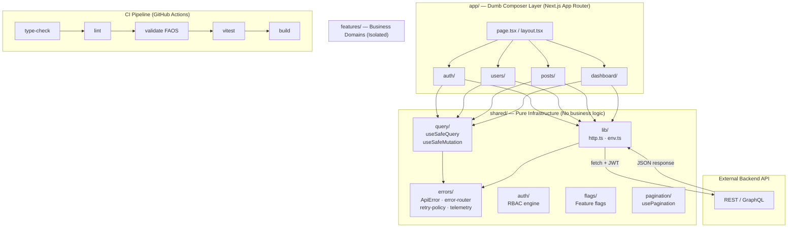

<div align="center">
  
  <h1>Next.js Tailwind Master Template</h1>
  <p>A highly-opinionated, production-ready template for building scalable web applications.</p>

  <div>
    
    
    
    
    
    
    
    
    
    
    
  </div>
</div>

<hr />

## 🗺️ Architecture Overview



---

## 🎯 Why this template?

Most Next.js projects start unstructured and grow into technical debt. This template enforces:

- **Scalable folder structure** — FAOS v5 feature-oriented architecture
- **Consistent state management** — React Query for server state, Zustand for UI state
- **Standardized API layer** — Zod-validated contracts at every feature boundary
- **Predictable UI composition** — strict ESLint + AST-level boundary enforcement

## ✨ Features

- **Framework**: [Next.js 15](https://nextjs.org/) (App Router)
- **UI & Styling**: [Tailwind CSS v3](https://tailwindcss.com/), [clsx](https://github.com/lukeed/clsx), [tailwind-merge](https://github.com/dcastil/tailwind-merge)
- **State Management**: [Zustand v5](https://github.com/pmndrs/zustand) — UI state only
- **Data Fetching**: [TanStack Query v5](https://tanstack.com/query/latest) with `useSafeQuery` / `useSafeMutation` wrappers
- **Runtime Safety**: [Zod v4](https://zod.dev/) — API contract validation at every feature boundary
- **Error Handling**: Typed `ApiError` → `error-router` → toast/logout/form/retry pipeline
- **Auth Architecture**: API-agnostic Auth Client Adapter with RBAC engine
- **Feature Flags**: Swappable `FlagEngine` adapter via `shared/flags/`
- **Animations**: [Framer Motion v12](https://www.framer.com/motion/)
- **Data Visualization**: [Recharts v3](https://recharts.org/)
- **Icons**: [Lucide React](https://lucide.dev/)
- **Package Manager**: [pnpm v9](https://pnpm.io/) — fast, disk-efficient
- **Testing**: [Vitest](https://vitest.dev/) + [React Testing Library](https://testing-library.com/) + [Playwright](https://playwright.dev/) E2E
- **Component Dev**: [Storybook 8](https://storybook.js.org/) with `@storybook/nextjs` adapter
- **Git Hygiene**: [Husky](https://typicode.github.io/husky/) hooks + [lint-staged](https://github.com/lint-staged/lint-staged) + [Commitlint](https://commitlint.js.org/) (Conventional Commits)
- **CI/CD**: GitHub Actions — type-check → lint → FAOS validate → test → build → Vercel preview

---

## 📦 Getting Started

### Prerequisites

- [Node.js](https://nodejs.org/) v20+
- [pnpm](https://pnpm.io/installation) v9+ — `npm install -g pnpm`

### Installation

```bash
# 1. Clone the repo
git clone <your-repo-url>
cd next-tailwind-template

# 2. Install dependencies (also initializes Husky git hooks)
pnpm install

# 3. Set up environment variables
cp .env.example .env.local
# Edit .env.local with your values

# 4. Start the development server
pnpm dev
```

Open [http://localhost:3000](http://localhost:3000).

### Environment Variables

Copy `.env.example` to `.env.local` and fill in the required values:

```env
# Required — your backend API base URL
NEXT_PUBLIC_API_URL=http://localhost:3001

# Optional
NEXT_PUBLIC_SITE_URL=http://localhost:3000
NEXT_PUBLIC_APP_ENV=development   # development | staging | production
```

> All env vars are Zod-validated at startup via `src/shared/lib/env.ts`. The app will throw immediately on startup if required vars are missing or malformed.

---

## 📂 Project Structure

```text
src/
├── app/                        # Next.js App Router (thin composer only)
├── features/                   # Business domains — each is fully isolated
│   ├── auth/
│   │   ├── api/                # login.api.ts
│   │   ├── components/         # Can.tsx (RBAC gate)
│   │   ├── hooks/              # usePermissions.ts
│   │   ├── stores/             # auth.store.ts
│   │   └── feature.manifest.ts # CI-only dependency declaration
│   ├── users/
│   │   ├── api/                # users.client.ts, users.keys.ts
│   │   ├── contracts/          # users.contract.ts (Zod schema)
│   │   ├── hooks/              # useUsers.ts
│   │   ├── components/         # UserListSkeleton.tsx + stories
│   │   └── feature.manifest.ts
│   ├── dashboard/              # Read-only data display (Recharts)
│   │   ├── api/                # dashboard.client.ts, dashboard.keys.ts
│   │   ├── contracts/          # dashboard.contract.ts
│   │   ├── hooks/              # useDashboardStats.ts
│   │   ├── components/         # StatsCard.tsx, RevenueChart.tsx
│   │   └── feature.manifest.ts
│   └── posts/                  # Full CRUD reference implementation
│       ├── api/                # posts.client.ts, posts.keys.ts
│       ├── contracts/          # posts.contract.ts
│       ├── hooks/              # posts.hooks.ts (usePosts, useCreatePost, useDeletePost)
│       ├── components/         # PostList.tsx, CreatePostForm.tsx, DeletePostButton.tsx
│       └── feature.manifest.ts
└── shared/                     # Pure infrastructure — no business logic
    ├── auth/                   # RBAC engine (roles, permissions, rbac)
    ├── components/             # Skeleton.tsx (+ stories)
    ├── errors/                 # ApiError, error-router, retry-policy, map-validation
    ├── flags/                  # FlagEngine, useFeatureFlag
    ├── lib/                    # http.ts, env.ts (Zod-validated)
    ├── pagination/             # usePagination (URL-safe)
    └── query/                  # useSafeQuery, useSafeMutation

tools/
└── validate-architecture.mjs   # AST boundary enforcer (CI-only)

.storybook/                     # Storybook 8 config
e2e/                            # Playwright E2E tests
.github/workflows/              # GitHub Actions CI + preview deploy
.husky/                         # Git hooks (pre-commit, commit-msg)
```

---

## 🛠️ Scripts

| Command                | Description                                                           |
| ---------------------- | --------------------------------------------------------------------- |
| `pnpm dev`             | Start the local development server                                    |
| `pnpm build`           | Build for production                                                  |
| `pnpm start`           | Start the production server                                           |
| `pnpm lint`            | ESLint — checks feature isolation, shared purity, and app layer rules |
| `pnpm type-check`      | TypeScript compiler check (no emit)                                   |
| `pnpm validate`        | **FAOS Architecture Validator** — AST scan for boundary violations    |
| `pnpm format`          | Format all files with Prettier                                        |
| `pnpm clean`           | Remove `.next`, `out`, `coverage`, `playwright-report`                |
| `pnpm test`            | Run Vitest unit + component tests (single run)                        |
| `pnpm test:watch`      | Run Vitest in watch mode                                              |
| `pnpm test:coverage`   | Run tests with v8 coverage report (60% thresholds)                    |
| `pnpm test:e2e`        | Run Playwright E2E tests (auto-starts dev server)                     |
| `pnpm test:e2e:ui`     | Playwright interactive UI mode                                        |
| `pnpm storybook`       | Start Storybook on [http://localhost:6006](http://localhost:6006)     |
| `pnpm build-storybook` | Build static Storybook                                                |

---

## 🧪 Testing

### Unit & Component Tests (Vitest)

```bash
pnpm test              # single run
pnpm test:watch        # watch mode
pnpm test:coverage     # with coverage report
```

Tests live alongside the code in `__tests__/` directories:

- `src/shared/lib/__tests__/http.test.ts` — HTTP client + error categories
- `src/shared/errors/__tests__/retry-policy.test.ts` — retry counts per error type
- `src/features/users/__tests__/useUsers.test.ts` — hook integration test
- `src/features/users/components/__tests__/UserListSkeleton.test.tsx` — component test

### E2E Tests (Playwright)

```bash
pnpm test:e2e          # run all E2E tests (auto-starts dev server)
pnpm test:e2e:ui       # interactive UI mode for debugging
```

Before running E2E tests for the first time, install the browser:

```bash
npx playwright install chromium
```

### Component Stories (Storybook)

```bash
pnpm storybook         # start on http://localhost:6006
```

---

## 🔀 Git Workflow

This repo enforces **Conventional Commits** via Husky + Commitlint. Every commit message must match:

```
<type>(<scope>): <description>

Types: feat | fix | docs | style | refactor | test | chore | ci | perf
```

Examples:

```bash
git commit -m "feat(posts): add delete post mutation"
git commit -m "fix(auth): handle expired token refresh"
git commit -m "chore: update dependencies"
```

The `pre-commit` hook automatically lints and formats all staged files before the commit is allowed.

---

## 🔄 CI/CD

**GitHub Actions** runs on every push to `main`/`develop` and on every PR:

```
Install (pnpm, cached) → type-check → lint → FAOS validate → vitest → build
```

**Preview deploys** — every PR gets an automatic Vercel preview URL posted as a PR comment.

Required GitHub repository secrets for preview deploys:
| Secret | Description |
|---|---|
| `VERCEL_TOKEN` | Vercel API token |
| `NEXT_PUBLIC_API_URL` | Staging API URL |
| `NEXT_PUBLIC_SITE_URL` | Staging frontend URL |

---

## 🧠 Architecture

See the full docs in [`docs/Framework-Structure/`](./docs/Framework-Structure/):

- [**Engineering Handbook**](./docs/Framework-Structure/engineering-handbook.md) — authoritative rules for all engineers
- [**Beginner's Guide**](./docs/Framework-Structure/beginner-guide.md) — step-by-step walkthrough to build your first feature
- [**API Error Guide**](./docs/Framework-Structure/api-error-guide.md) — error handling patterns

### Key Principles

- **Feature Isolation** — no feature can import from another feature. Enforced by ESLint + AST validator.
- **Shared Kernel Purity** — `shared/` has zero knowledge of any business domain.
- **App Layer is Dumb** — `app/` only composes features, never implements logic.
- **Zod at the Boundary** — every API response validated before entering React state.
- **Retry by Category** — `AUTH`/`FORBIDDEN` errors are never retried. `NETWORK`/`SERVER` get 2–3 retries.

---

## 🌐 Deployment

Push to GitHub and connect the repository in your [Vercel dashboard](https://vercel.com/new).

Set these environment variables in Vercel:

```
NEXT_PUBLIC_API_URL=https://api.yourapp.com
NEXT_PUBLIC_SITE_URL=https://yourapp.com
NEXT_PUBLIC_APP_ENV=production
```

---

<div align="center">
  <i>Built with ❤️ using Next.js, Tailwind CSS & pnpm</i>
</div>

## 🗺️ Architecture Overview


## 🎯 Why this template?

Most Next.js projects start unstructured and grow into technical debt.
This template enforces:

- scalable folder structure
- consistent state management
- standardized API layer
- predictable UI composition

## ✨ Features

- **Framework**: [Next.js](https://nextjs.org/) (App Router enabled)
- **UI & Styling**: [Tailwind CSS v3](https://tailwindcss.com/) for utility-first styling, [clsx](https://github.com/lukeed/clsx) & [tailwind-merge](https://github.com/dcastil/tailwind-merge) for dynamic class handling.
- **State Management**: [Zustand](https://github.com/pmndrs/zustand) for lightweight, fast, and scalable global state.
- **Data Fetching**: Pure [React Query (v5)](https://tanstack.com/query/latest) paired with native `fetch` for robust API communication without unnecessary abstraction layers.
- **Error Handling**: Built-in global API error toasts via [Sonner](https://sonner.emilkowal.ski/) tied directly into React Query cache boundaries.
- **Auth Architecture**: API-agnostic Auth Client Adapter for token and session state management.
- **Animations**: [Framer Motion](https://www.framer.com/motion/) for fluid, declarative animations.
- **Data Visualization**: [Recharts](https://recharts.org/) for beautiful, responsive charts.
- **Icons**: [Lucide React](https://lucide.dev/) for crisp, consistent SVG icons.
- **Developer Experience**: Fully configured with TypeScript, strict Feature-Isolation ESLint boundaries (`eslint.config.mjs`), and Prettier.
- **Runtime Safety**: [Zod](https://zod.dev/) for API contract validation at the feature boundary — backend drift throws immediately.
- **RBAC**: Role-based access control via pure engine in `shared/auth/` consumed via `usePermissions()` and `<Can>` component.

## 🧠 Architecture

This project follows a Pure TanStack architecture:

- **Next.js** → routing + rendering
- **TanStack Query** → server state management (`useSafeQuery` / `useSafeMutation`)
- **Native fetch** → HTTP layer (`shared/lib/http.ts`)
- **Zustand** → UI state only
- **Zod** → API contract enforcement at feature boundary
- **Feature-based architecture is enforced across the entire codebase with strict import boundaries.**

### 🌍 Environment Assumption

This frontend assumes:

- External API backend
- JWT or token-based auth (optional)
- REST or GraphQL compatible endpoints

### 🧠 Data Layer Rules

**Data Flow**:
UI Component  
→ React Query Hook  
→ Feature API Service (`*.client.ts`)
→ Shared Fetcher (`http.ts`)
→ Backend API  
→ Response cached in React Query

**State Rules**:

- **Server State**: React Query is the single source of truth for server state caching and synchronization.
- **UI State**: Zustand is strictly for UI state only.

**API Rules**:

- 🔐 **Data Fetching**: All API communication must go through `features/*/api/*.client.ts` or `shared/lib/http`. No direct fetch calls in components.
- **API Contract Assumption**: All API responses are external contracts and must be treated as unstable unless typed explicitly in each feature.

**Error Handling Rules**:

- **Error Model**: All API errors are normalized by `http.ts` into a typed `ApiError` with an `ErrorCategory`. Routed globally via `error-router.ts`. Components never inspect raw status codes.
- **Error Pipeline**: `http.ts → ApiError → error-router → [toast | logout | form | retry]`
- **Retry Policy**: React Query retries are policy-driven via `shared/errors/retry-policy.ts`, not hardcoded.
- **Form Errors**: `VALIDATION` (422) errors bypass the global toast and are mapped to form fields via `mapApiValidationToForm`.

### 🚧 Architecture Boundaries

- **Feature Isolation**: Feature-to-feature imports are forbidden. Only `app/` can compose multiple features. **Enforced via ESLint + `npm run validate` (AST scanner).**
- **Shared Kernel Constraint**: `shared/` must never import from `features/` or `app/`. It is strictly deterministic infrastructure.
- **App Layer Constraint**: `app/` cannot import `@tanstack/react-query` directly. It must consume hooks from `features/`.
- **Import Strategy**: Use absolute imports only (`@/app`, `@/features`, `@/shared`). Relative imports beyond 1 level are forbidden.
- **Types / Contracts**: Each feature owns its own `contracts/` (Zod schemas) and `types.ts`. Shared types are only for cross-domain primitives.

### 🧩 System Primitives (FAOS)

Our architecture provides deterministic, non-runtime system primitives:

- **RBAC**: `shared/auth/rbac.ts` (pure engine) + `usePermissions()` + `<Can permission="...">` component.
- **Feature Flags**: `shared/flags/` with a swappable `FlagEngine` adapter (`useFeatureFlag()`).
- **Pagination**: URL-safe `usePagination()` bound to `useSearchParams` — page state lives in the URL, never in Zustand.
- **Error Kernel**: `shared/errors/` — `ApiError` → `error-router` → `retry-policy` → `map-validation` → `use-error-telemetry`.
- **Query Wrappers**: `useSafeQuery` / `useSafeMutation` in `shared/query/` — apply retry policy and error routing automatically.
- **Zod Contracts**: Each feature's `contracts/` folder holds Zod schemas. API responses are parsed at the `*.client.ts` boundary.
- **Feature Manifests**: `feature.manifest.ts` per feature — CI-only static declarations of dependencies and public surface.
- **Architecture Validator**: `npm run validate` — AST scanner that blocks builds on any boundary violation.

### 🧱 Design Philosophy

This template prioritizes:

- **Predictability** over abstraction.
- **Composition** over complexity.
- **Native Web APIs** over third-party wrappers.

## 🧪 Tech Decisions

- **Zustand over Redux** → Less boilerplate, faster onboarding, excellent performance.
- **Pure React Query** → Server-state separation and smart caching out of the box without the need for an external API wrapper like Axios or Apisauce.
- **Native Fetch** → Embracing modern web standards. No extra HTTP dependencies.
- **Framer Motion** → Declarative, easy-to-read animations.

## 📦 Getting Started

### Prerequisites

Ensure you have [Node.js](https://nodejs.org/) (v20+ recommended) and a package manager installed.

### Installation

1. Clone the repository and navigate into the project directory:

   ```bash
   git clone <your-repo-url>
   cd next-tailwind-template
   ```

2. Install dependencies:
   ```bash
   pnpm install
   ```

### 🔐 Environment Variables

Create a `.env.local` file at the root of the project to add required environment variables:

```env
NEXT_PUBLIC_API_URL=http://localhost:3001
```

3. Start the development server:

   ```bash
   pnpm dev
   ```

4. Open [http://localhost:3000](http://localhost:3000) in your browser to see the app running.

## 📂 Project Structure

```text
src/
├── app/                     # Next.js routes (thin composer layer only)
├── features/                # Domain logic — each feature is self-contained
│   ├── auth/
│   │   ├── api/             # login.api.ts
│   │   ├── components/      # Can.tsx (RBAC gate)
│   │   ├── hooks/           # usePermissions.ts
│   │   ├── stores/          # auth.store.ts
│   │   └── feature.manifest.ts  # CI-only dependency declaration
│   └── users/
│       ├── api/             # users.client.ts, users.keys.ts
│       ├── contracts/       # users.contract.ts (Zod schema)
│       ├── hooks/           # useUsers.ts
│       └── feature.manifest.ts
└── shared/                  # Pure infrastructure — no business logic
    ├── auth/                # RBAC engine (roles, permissions, rbac)
    ├── errors/              # ApiError, error-router, retry-policy, map-validation
    ├── flags/               # FlagEngine, useFeatureFlag
    ├── lib/                 # http.ts, query-provider.tsx
    ├── pagination/          # usePagination (URL-safe), PaginatedResponse<T>
    └── query/               # useSafeQuery, useSafeMutation
tools/
└── validate-architecture.mjs  # AST boundary enforcer (CI-only)
package.json
eslint.config.mjs            # Flat-config boundary rules
tsconfig.json
```

## 🛠️ Scripts

| Command                | Description                                                           |
| ---------------------- | --------------------------------------------------------------------- |
| `pnpm dev`             | Start the local development server                                    |
| `pnpm build`           | Build for production                                                  |
| `pnpm start`           | Start the production server                                           |
| `pnpm lint`            | ESLint — checks feature isolation, shared purity, and app layer rules |
| `pnpm type-check`      | TypeScript compiler check (no emit)                                   |
| `pnpm validate`        | **FAOS Architecture Validator** — AST scan for boundary violations    |
| `pnpm format`          | Format all files with Prettier                                        |
| `pnpm clean`           | Remove `.next`, `out`, `coverage`, and `playwright-report`            |
| `pnpm test`            | Run Vitest unit + component tests (single run)                        |
| `pnpm test:watch`      | Run Vitest in watch mode                                              |
| `pnpm test:coverage`   | Run tests with v8 coverage report                                     |
| `pnpm test:e2e`        | Run Playwright E2E tests (auto-starts dev server)                     |
| `pnpm test:e2e:ui`     | Playwright interactive UI mode                                        |
| `pnpm storybook`       | Start Storybook on port 6006                                          |
| `pnpm build-storybook` | Build static Storybook                                                |

## 🌐 Deployment

This project is configured for easy deployment on **Vercel**, the platform created by the makers of Next.js. Simply push your code to GitHub and connect the repository in your Vercel dashboard.

---

<div align="center">
  <i>Built with ❤️ using Next.js & Tailwind CSS</i>
</div>
