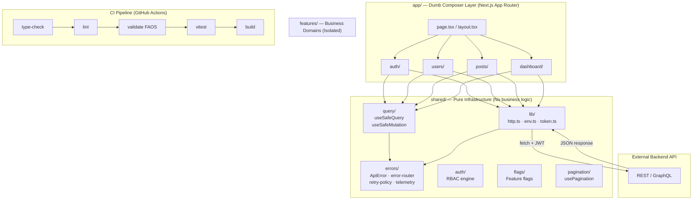

<div align="center">
  
  <h1>Next.js Tailwind Master Template</h1>
  <p>A highly-opinionated, production-ready template for building scalable web applications.</p>

  <div>
    
    
    
    
    
    
    
    
    
    
    
  </div>
</div>

<hr />

## 🗺️ Architecture Overview



---

## 🎯 Why this template?

Most Next.js projects start unstructured and grow into technical debt. This template enforces:

- **Scalable folder structure** — FAOS feature-oriented architecture
- **Consistent state management** — React Query for server state, Zustand for UI state
- **Standardized API layer** — Zod-validated contracts at every feature boundary
- **Predictable UI composition** — strict ESLint + a static import-boundary validator

## ✨ Features

- **Framework**: [Next.js 15](https://nextjs.org/) (App Router)
- **UI & Styling**: [Tailwind CSS v3](https://tailwindcss.com/), [clsx](https://github.com/lukeed/clsx), [tailwind-merge](https://github.com/dcastil/tailwind-merge)
- **State Management**: [Zustand v5](https://github.com/pmndrs/zustand) — UI state only
- **Data Fetching**: [TanStack Query v5](https://tanstack.com/query/latest) with `useSafeQuery` / `useSafeMutation` wrappers
- **Runtime Safety**: [Zod v4](https://zod.dev/) — API contract validation at every feature boundary
- **Error Handling**: Typed `ApiError` → `error-router` → toast/logout/form/retry pipeline
- **Auth Architecture**: API-agnostic Auth Client Adapter with RBAC engine
- **Feature Flags**: Swappable `FlagEngine` adapter via `shared/flags/`
- **Animations**: [Framer Motion v12](https://www.framer.com/motion/)
- **Data Visualization**: [Recharts v3](https://recharts.org/)
- **Icons**: [Lucide React](https://lucide.dev/)
- **Package Manager**: [pnpm v9](https://pnpm.io/) — fast, disk-efficient
- **Testing**: [Vitest](https://vitest.dev/) + [React Testing Library](https://testing-library.com/) + [Playwright](https://playwright.dev/) E2E
- **Component Dev**: [Storybook 8](https://storybook.js.org/) with `@storybook/nextjs` adapter
- **Git Hygiene**: [Husky](https://typicode.github.io/husky/) hooks + [lint-staged](https://github.com/lint-staged/lint-staged) + [Commitlint](https://commitlint.js.org/) (Conventional Commits)
- **CI/CD**: GitHub Actions — type-check → lint → FAOS validate → test → build → Vercel preview

---

## 📦 Getting Started

### Prerequisites

- [Node.js](https://nodejs.org/) v20+
- [pnpm](https://pnpm.io/installation) v9+ — `npm install -g pnpm`

### Installation

```bash
# 1. Clone the repo
git clone <your-repo-url>
cd next-tailwind-template

# 2. Install dependencies (also initializes Husky git hooks)
pnpm install

# 3. Set up environment variables
cp .env.example .env.local
# Edit .env.local with your values

# 4. Start the development server
pnpm dev
```

Open [http://localhost:3000](http://localhost:3000).

### Environment Variables

Copy `.env.example` to `.env.local` and fill in the required values:

```env
# Required — your backend API base URL
NEXT_PUBLIC_API_URL=http://localhost:3001

# Optional
NEXT_PUBLIC_SITE_URL=http://localhost:3000
NEXT_PUBLIC_APP_ENV=development   # development | staging | production
```

> All env vars are Zod-validated at startup via `src/shared/lib/env.ts`. The app will throw immediately on startup if required vars are missing or malformed.

---

## 📂 Project Structure

```text
src/
├── app/                        # Next.js App Router (thin composer only)
├── features/                   # Business domains — each is fully isolated
│   ├── auth/
│   │   ├── api/                # login.api.ts
│   │   ├── components/         # Can.tsx (RBAC gate)
│   │   ├── hooks/              # usePermissions.ts
│   │   ├── stores/             # auth.store.ts
│   │   └── feature.manifest.ts # CI-only dependency declaration
│   ├── users/
│   │   ├── api/                # users.client.ts, users.keys.ts
│   │   ├── contracts/          # users.contract.ts (Zod schema)
│   │   ├── hooks/              # useUsers.ts
│   │   ├── components/         # UserListSkeleton.tsx + stories
│   │   └── feature.manifest.ts
│   ├── dashboard/              # Read-only data display (Recharts)
│   │   ├── api/                # dashboard.client.ts, dashboard.keys.ts
│   │   ├── contracts/          # dashboard.contract.ts
│   │   ├── hooks/              # useDashboardStats.ts
│   │   ├── components/         # StatsCard.tsx, RevenueChart.tsx
│   │   └── feature.manifest.ts
│   └── posts/                  # Full CRUD reference implementation
│       ├── api/                # posts.client.ts, posts.keys.ts
│       ├── contracts/          # posts.contract.ts
│       ├── hooks/              # posts.hooks.ts (usePosts, useCreatePost, useDeletePost)
│       ├── components/         # PostList.tsx, CreatePostForm.tsx, DeletePostButton.tsx
│       └── feature.manifest.ts
└── shared/                     # Pure infrastructure — no business logic
    ├── auth/                   # RBAC engine (roles, permissions, rbac)
    ├── components/             # Skeleton.tsx (+ stories)
    ├── errors/                 # ApiError, error-router, retry-policy, map-validation
    ├── flags/                  # FlagEngine, useFeatureFlag
    ├── lib/                    # http.ts, env.ts (Zod-validated), token.ts
    ├── pagination/             # usePagination (URL-safe)
    └── query/                  # useSafeQuery, useSafeMutation

tools/
└── validate-architecture.mjs   # Static import-boundary validator (CI-only)

.storybook/                     # Storybook 8 config
e2e/                            # Playwright E2E tests
.github/workflows/              # GitHub Actions CI + preview deploy
.husky/                         # Git hooks (pre-commit, commit-msg)
```

---

## 🛠️ Scripts

| Command                | Description                                                                  |
| ---------------------- | ---------------------------------------------------------------------------- |
| `pnpm dev`             | Start the local development server                                           |
| `pnpm build`           | Build for production                                                         |
| `pnpm start`           | Start the production server                                                  |
| `pnpm lint`            | ESLint — checks feature isolation, shared purity, and app layer rules        |
| `pnpm type-check`      | TypeScript compiler check (no emit)                                          |
| `pnpm validate`        | **FAOS Architecture Validator** — static import scan for boundary violations |
| `pnpm format`          | Format all files with Prettier                                               |
| `pnpm clean`           | Remove `.next`, `out`, `coverage`, `playwright-report`                       |
| `pnpm test`            | Run Vitest unit + component tests (single run)                               |
| `pnpm test:watch`      | Run Vitest in watch mode                                                     |
| `pnpm test:coverage`   | Run tests with v8 coverage report (60% thresholds)                           |
| `pnpm test:e2e`        | Run Playwright E2E tests (auto-starts dev server)                            |
| `pnpm test:e2e:ui`     | Playwright interactive UI mode                                               |
| `pnpm storybook`       | Start Storybook on [http://localhost:6006](http://localhost:6006)            |
| `pnpm build-storybook` | Build static Storybook                                                       |

---

## 🧪 Testing

### Unit & Component Tests (Vitest)

```bash
pnpm test              # single run
pnpm test:watch        # watch mode
pnpm test:coverage     # with coverage report
```

Tests live alongside the code in `__tests__/` directories:

- `src/shared/lib/__tests__/http.test.ts` — HTTP client + error categories
- `src/shared/errors/__tests__/retry-policy.test.ts` — retry counts per error type
- `src/features/users/__tests__/useUsers.test.ts` — hook integration test
- `src/features/users/components/__tests__/UserListSkeleton.test.tsx` — component test

### E2E Tests (Playwright)

```bash
pnpm test:e2e          # run all E2E tests (auto-starts dev server)
pnpm test:e2e:ui       # interactive UI mode for debugging
```

Before running E2E tests for the first time, install the browser:

```bash
npx playwright install chromium
```

### Component Stories (Storybook)

```bash
pnpm storybook         # start on http://localhost:6006
```

---

## 🧠 Architecture

This project follows a **Pure TanStack** architecture:

- **Next.js** → routing + rendering
- **TanStack Query** → server state management (`useSafeQuery` / `useSafeMutation`)
- **Native fetch** → HTTP layer (`shared/lib/http.ts`)
- **Zustand** → UI state only
- **Zod** → API contract enforcement at the feature boundary

Full docs live in [`docs/Framework-Structure/`](./docs/Framework-Structure/):

- [**Engineering Handbook**](./docs/Framework-Structure/engineering-handbook.md) — authoritative rules for all engineers
- [**Beginner's Guide**](./docs/Framework-Structure/beginner-guide.md) — step-by-step walkthrough to build your first feature
- [**API Error Guide**](./docs/Framework-Structure/api-error-guide.md) — error handling patterns

### 🌍 Environment Assumption

This frontend assumes an external API backend, optional JWT/token-based auth, and REST or GraphQL-compatible endpoints.

### 🧠 Data Layer Rules

**Data flow:**
UI Component → React Query Hook → Feature API Service (`*.client.ts`) → Shared Fetcher (`http.ts`) → Backend API → Response cached in React Query.

- **Server state**: React Query is the single source of truth for server-state caching and synchronization.
- **UI state**: Zustand is strictly for UI state only.
- **Data fetching**: all API communication goes through `features/*/api/*.client.ts` or `shared/lib/http`. No direct `fetch` in components.
- **Contracts**: API responses are external and unstable — each feature parses them through its own Zod schema (`contracts/`) at the `*.client.ts` boundary before they enter React state.

### ⚠️ Error Handling Rules

- **Error model**: `http.ts` normalizes all API errors into a typed `ApiError` with an `ErrorCategory`. Components never inspect raw status codes.
- **Pipeline**: `http.ts → ApiError → error-router → [toast | logout | form | retry]`. Logging, toasts, and logout-on-`AUTH` are applied globally by the `QueryCache` / `MutationCache` configured in `shared/lib/providers/query-provider.tsx`.
- **Retry policy**: React Query retries are policy-driven via `shared/errors/retry-policy.ts`, not hardcoded (`NETWORK` → 3, `5xx` → 2, `429` → 1, everything else → 0).
- **Form errors**: `VALIDATION` (422) errors bypass the global toast and are mapped to form fields via `mapApiValidationToForm` / `useSafeMutation`'s `onValidationError`.

### 🚧 Architecture Boundaries

- **Feature isolation** — no feature imports from another feature. Only `app/` composes multiple features.
- **Shared kernel purity** — `shared/` never imports from `features/` or `app/`. It is deterministic infrastructure.
- **App layer is dumb** — `app/` cannot import `@tanstack/react-query` directly; it consumes hooks exported by features.
- **Import strategy** — absolute aliases only (`@/app`, `@/features`, `@/shared`); deep relative imports (`../../`) are forbidden.

All four rules are enforced two ways: in-editor via ESLint (`eslint.config.mjs`) and in CI via `pnpm validate` (`tools/validate-architecture.mjs`), a static import scanner that blocks the build on any boundary violation.

### 🧩 System Primitives (FAOS)

- **RBAC**: `shared/auth/rbac.ts` (pure engine) + `usePermissions()` + `<Can permission="...">`.
- **Feature Flags**: `shared/flags/` with a swappable `FlagEngine` adapter (`useFeatureFlag()`).
- **Pagination**: URL-safe `usePagination()` bound to `useSearchParams` — page state lives in the URL, never in Zustand.
- **Error Kernel**: `shared/errors/` — `ApiError` → `error-router` → `retry-policy` → `map-validation` → `use-error-telemetry`.
- **Query Wrappers**: `useSafeQuery` / `useSafeMutation` in `shared/query/`.
- **Auth Token**: `shared/lib/token.ts` is the single source of truth for the JWT (see the security note below).
- **Feature Manifests**: `feature.manifest.ts` per feature — CI-only static declarations of dependencies and public surface.

### 🔐 Auth & Security Note

The JWT is stored in `localStorage` via `shared/lib/token.ts` for portability with any backend. `localStorage` is readable by any script on the page and is therefore vulnerable to XSS token theft. **For production, prefer an httpOnly, Secure, SameSite cookie set by your backend** — swapping the four functions in `token.ts` is the only change required on the client.

### 🧱 Design Philosophy

This template prioritizes **predictability over abstraction**, **composition over complexity**, and **native web APIs over third-party wrappers**.

## 🧪 Tech Decisions

- **Zustand over Redux** → less boilerplate, faster onboarding, excellent performance.
- **Pure React Query** → server-state separation and smart caching without an HTTP wrapper like Axios.
- **Native fetch** → modern web standards, no extra HTTP dependencies.
- **Framer Motion** → declarative, easy-to-read animations.

---

## 🔀 Git Workflow

This repo enforces **Conventional Commits** via Husky + Commitlint. Every commit message must match:

```
<type>(<scope>): <description>

Types: feat | fix | docs | style | refactor | test | chore | ci | perf
```

Examples:

```bash
git commit -m "feat(posts): add delete post mutation"
git commit -m "fix(auth): handle expired token refresh"
git commit -m "chore: update dependencies"
```

The `pre-commit` hook automatically lints and formats all staged files before the commit is allowed.

---

## 🔄 CI/CD

**GitHub Actions** runs on every push to `main`/`develop` and on every PR:

```
Install (pnpm, cached) → type-check → lint → FAOS validate → vitest → build
```

**Preview deploys** — every PR gets an automatic Vercel preview URL posted as a PR comment.

Required GitHub repository secrets for preview deploys:
| Secret | Description |
|---|---|
| `VERCEL_TOKEN` | Vercel API token |
| `NEXT_PUBLIC_API_URL` | Staging API URL |
| `NEXT_PUBLIC_SITE_URL` | Staging frontend URL |

---

## 🌐 Deployment

Push to GitHub and connect the repository in your [Vercel dashboard](https://vercel.com/new).

Set these environment variables in Vercel:

```
NEXT_PUBLIC_API_URL=https://api.yourapp.com
NEXT_PUBLIC_SITE_URL=https://yourapp.com
NEXT_PUBLIC_APP_ENV=production
```

---

<div align="center">
  <i>Built with ❤️ using Next.js, Tailwind CSS & pnpm</i>
</div>
